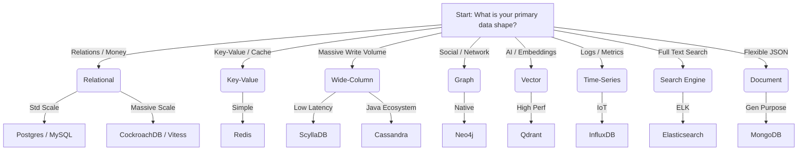

# The Database Decision Matrix: Architecture, Java Patterns, and Case Studies

> **The Architect’s Handbook for Database Selection**: A comprehensive guide mapping system design scenarios to optimal data stores, cost-effective hosting, and production-grade Java implementation patterns.

This repository serves as a definitive resource for Senior Software Engineers and Architects. It combines theoretical depth with practical Java implementations, real-world architectural case studies, and a hands-on Docker playground.

## 🚀 Quick Start

- **[The Master Mapper](./DATABASE_MAPPER.md)**: A giant cheat sheet comparing 13+ databases (CAP, Storage Engines, Indexes).
- **[The Infrastructure Playground](./PLAYGROUND.md)**: Spin up 9 different databases (Postgres, Mongo, Neo4j, Qdrant, etc.) with one command.

---

## 🎯 The Decision Matrix

## 📚 Database Profiles (Internals & Scaling)

We go deep into how these engines work (B-Trees, LSM-Trees, HNSW, Inverted Indexes).

1.  **[Relational (SQL)](./db-profiles/relational.md)**: Postgres, MySQL, CockroachDB.
2.  **[Key-Value](./db-profiles/nosql-key-value.md)**: Redis.
3.  **[Wide-Column](./db-profiles/nosql-wide-column.md)**: Cassandra, ScyllaDB.
4.  **[Document](./db-profiles/nosql-document.md)**: MongoDB.
5.  **[Vector (AI)](./db-profiles/vector.md)**: Qdrant, Pinecone.
6.  **[Graph](./db-profiles/graph.md)**: Neo4j.
7.  **[Search](./db-profiles/search.md)**: Elasticsearch.
8.  **[Time-Series](./db-profiles/time-series.md)**: InfluxDB.

## 🏆 Architectural Case Studies (The "Why")

Detailed teardowns of major industry migrations.

- **[Uber](./case-studies/uber-schemaless.md)**: Postgres &rarr; Schemaless (MySQL).
- **[Discord](./case-studies/discord-scylladb.md)**: MongoDB &rarr; ScyllaDB.
- **[DoorDash](./case-studies/doordash-cockroachdb.md)**: Aurora &rarr; CockroachDB.
- **[Slack](./case-studies/slack-vitess.md)**: MySQL &rarr; Vitess.
- **[Notion](./case-studies/notion-sharding.md)**: Postgres &rarr; Sharded Postgres.
- **[Stripe](./case-studies/stripe-radar.md)**: Graph DBs for Fraud Detection.
- **[Pinterest](./case-studies/pinterest-vectors.md)**: Vector Search for Images.
- **[Robinhood](./case-studies/robinhood-timeseries.md)**: Time-Series for Stock Ticks.
- **[Wikipedia](./case-studies/wikipedia-elastic.md)**: Elasticsearch for Search.

## ☕ Java Design Patterns

- **[Repository](./java-patterns/repository-pattern.md)**, **[Proxy](./java-patterns/proxy-pattern.md)**, **[Data Mapper](./java-patterns/data-mapper.md)**, **[CQRS](./java-patterns/cqrs-pattern.md)**.
- **[Resilience](./java-patterns/resilience.md)**: Circuit Breakers (Resilience4j).

## 💰 Hosting Strategies

- **[Build vs Buy](./hosting-strategies/cost-comparison.md)**: When to use AWS RDS vs. Self-Hosted Docker.

---

_Built for the community by [RishiM1408](https://github.com/RishiM1408)._
