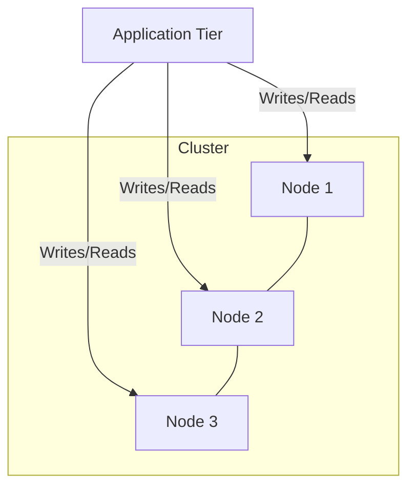

# Case Study: DoorDash (Aurora Postgres &rarr; CockroachDB)

> **The Problem**: Vertical Scaling Limits and Single-Writer Bottlenecks during the Pandemic Boom.

## 📈 The Trigger: Pandemic Growth

During 2020, DoorDash experienced unprecedented growth. Their primary database, a massive **AWS Aurora PostgreSQL** instance, was hitting a hard wall.

### 1. The Single Writer Bottleneck

- **Architecture**: Aurora allows 1 Writer node + 15 Read Replicas.
- **The Issue**: **All writes must go to the single primary node.**
- **The Limit**: Despite using the largest available instance type (r5.24xlarge), the write CPU utilization remained critically high (near 100%).

### 2. High Replication Lag

- During peak dinner rushes, the replication lag between the Writer and Readers would spike.
- **Impact**: A Dasher accepts an order (Write), but the app refreshes (Read from replica) and says "Order not found."

### 3. Maintenance Nightmares

- Scaling up meant a failover (downtime/interruption). A vertically scaled monolith is "too big to fail" and terrifying to upgrade.

---

## 🪳 The Solution: CockroachDB (Distributed SQL)

DoorDash migrated to **CockroachDB**, a cloud-native Distributed SQL database that speaks the PostgreSQL wire protocol.

### Why CockroachDB?

#### 1. Multi-Master Writes (Shared Nothing)

- **Architecture**: Every node in a CockroachDB cluster is a consistent gateway. You can send a write request to _any_ node.
- **Benefit**: Write throughput scales **linearly** with the number of nodes. If you need 2x write capacity, you add 2x nodes. No single bottleneck.

#### 2. Geo-Partitioning

- DoorDash operates in multiple regions.
- **Key Feature**: They can pin data to specific locations using _locality_ attributes. "Orders in New York" live on nodes in `us-east-1`, while "Orders in California" live in `us-west-1`.
- **Latency Win**: Reads and Writes are local.

#### 3. Resilience (Raft Consensus)

- CockroachDB uses the **Raft Consensus Algorithm** for replication.
- It tolerates node failures automatically without manual failover intervention.

## 📉 Visualizing the Shift

### Before (Aurora)

```mermaid
graph TD
    App[Application Tier] -->|Writes| W[Primary Writer (CPU 99%)]
    App -->|Reads| R1[Replica 1]
    App -->|Reads| R2[Replica 2]
    W -->|Replication Lag| R1
    W -->|Replication Lag| R2
```

### After (CockroachDB)



## 💡 Key Takeaway for Architects

> **"Vertical Scaling Has a Ceiling."**
>
> When your write volume exceeds what a single CPU can process, no amount of RAM will save you. You must shard. You can build sharding manually (like Uber did with MySQL) or adopt a database that handles sharding natively (CockroachDB/Vitess). DoorDash chose the latter to avoid maintaining complex custom sharding logic.
