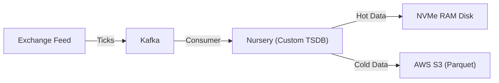

# Case Study: Robinhood Market Data (Time-Series)

> **The Problem**: Storing millions of price changes per second (Ticks) and serving real-time charts.

## 📈 The Challenge: High Velocity

The stock market doesn't stop.

- **Volume**: Every trade, quote, and order creates a data point.
- **Immutability**: You never "update" a stock price from 5 minutes ago. You only append new prices.
- **Query Pattern**: Users want "Candlestick Charts" (Open/High/Low/Close) for 1D, 1W, 1Y.

## 📉 The Solution: Specialized Time-Series Stores

Standard Relational DBs (B-Trees) fragment horribly when you insert millions of sorted IDs.
Time-Series DBs (TSDBs) are optimized for:

1.  **Ingest**: Appending sorted data at memory speed.
2.  **Compression**: Storing `100.00, 100.01` as `+0.01` (Delta Compression).
3.  **Downsampling**: Converting "1 million raw ticks" into "1,000 hourly candles" in the background (Rollups).

## 🏗️ The Move to "Nursery" (Custom Store)

Robinhood originally used InfluxDB but hit high-cardinality limits. They built **Nursery**.

### 1. The Pipeline

### 2. The "Stock Split" Problem

**Challenge**: Apple splits 4:1.

- **Immutable DB**: You cannot just "update" 10 years of history.
- **Solution**: They implemented a "Split Adjustment Factor" column. They don't rewrite history; they apply a math multiplier at query time.
  - `Raw Price: $400` \* `Factor: 0.25` = `Displayed: $100`.

### Storage Tiering (Hot/Warm/Cold)

To manage cost, they move data across storage mediums based on age.

- **Hot (RAM/NVMe)**: First 24 hours. Instant query for "Today's Chart".
- **Warm (SSD)**: 7 Days. Fast query for "1 Week View".
- **Cold (S3/Object Store)**: History. Slower query for "All Time". TSDBs manage this movement automatically.

### Why not Postgres?

- **PostgreSQL**: `SELECT AVG(price) FROM ticks WHERE symbol='AAPL'` scans millions of rows. Slow.
- **TSDB**: Uses pre-aggregated "Rollups" to answer the same query instantly.

## 🛠️ Concepts to Steal

- **Retention Policies**: Automatically delete data older than X years. "High precision for 1 day, Medium precision for 1 year."
- **Tags vs. Fields**: Storing `Symbol=AAPL` (Indexed Tag) vs `Price=150.00` (Unindexed Field) for speed.

## 💡 Key Takeaway

> **"Time is a Special Dimension."**
>
> If your data is immutable and always timestamped, generic databases are wasting 90% of your disk space and CPU. Use a TSDB.
