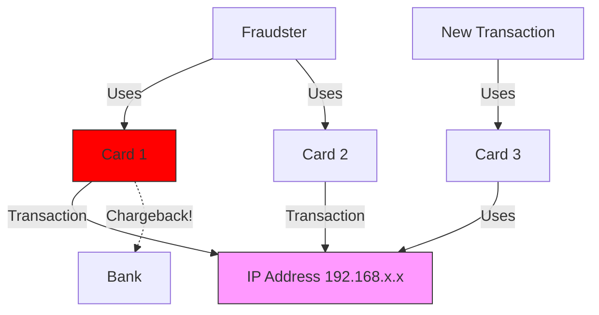

# Case Study: Stripe Radar (Graph Database)

> **The Problem**: Detecting sophisticated fraud rings that traditional rules ("IF amount > $500") miss.

## 🕵️ The Challenge: Fraud Rings

Fraudsters are smart. They don't use the same credit card twice.

- **Tactics**: They use 100 different stolen cards, on 100 different devices, but they might share a single **IP address**, or a similar **browser fingerprint**, or a common **email domain**.
- **The Data Shape**: This is a highly connected network problem.
  - `Card A` -> used on -> `Device 1`
  - `Card B` -> used on -> `Device 1` (Suspicious!)

## 🕸️ The Solution: The Knowledge Graph

Stripe Radar analyzes the **relationships** between data points, not just the data points themselves.

### Why Graph Databases? (Network Effects)

In a relational DB, asking "Find all cards that share an IP with any card that was previously marked as fraud" is a nightmare `JOIN` query that kills performance.
In a Graph DB (like Neo4j), this is a trivial traversal.

### The Cypher Query (Actual Code)

Here is how you would catch a "Card Tumbling" attack in Cypher (Neo4j's query language):

```cypher
// Find other cards used on the same device as the suspicious transaction
MATCH (tx:Transaction {id: "tx_123"})-[:INITIATED_BY]->(device:Device)
MATCH (device)<-[:INITIATED_BY]-(other_tx:Transaction)<-[:FUNDED_BY]-(other_card:Card)
WHERE other_card.status = "BLOCKED"
RETURN count(other_card) AS blocked_cards_on_device
```

### The Traversal Logic

1.  **Start**: Transaction `TX_123` comes in.
2.  **Hop 1**: Find the `IP_Address` node connected to this transaction.
3.  **Hop 2**: Find all other `Card` nodes connected to this `IP_Address`.
4.  **Hop 3**: Count how many of those `Card` nodes have a `[:HAS_CHARGEBACK]` relationship.
5.  **Result**: If Count > 5, BLOCK `TX_123`.

## 🧬 Algorithms: Community Detection

Stripe uses **WCC (Weakly Connected Components)** and **Louvain Modularity** to detect communities.

- **Concept**: If 50 seemingly unrelated accounts all share a specialized "Device Fingerprint" or "Shipping Address", they form a dense cluster in the graph.
- **Action**: You don't block the user. You block the _Cluster ID_.

## 📉 Visualizing the Graph



## 💡 Key Takeaway

> **"The Network IS The Feature."**
>
> For fraud detection, the value isn't in the row (the transaction amount), but in the **edges** (the shared history). Graph databases make these edges first-class citizens.
