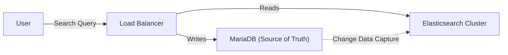

# Case Study: Wikipedia Search (Elasticsearch)

> **The Problem**: Searching 60 Million articles in 300+ languages with sub-millisecond latency.

## 🔍 The Challenge: Relevance & Nuance

SQL `LIKE '%term%'` is useless for humans.

- **Typos**: User types "Arnald Schwzeneger".
- **Stemming**: "Run", "Ran", "Running" should all match.
- **Ranking**: If I search "Apple", I want the company or the fruit, not a random user named "Apple123".

## 📚 The Solution: Elasticsearch (Lucene)

Wikipedia moved from MySQL full-text search to **Elasticsearch**.

### 1. Inverted Indexes

It maps every single word in every article to a list of Article IDs.

- **Speed**: Intersection of lists is massivey faster than scanning table rows.

### 2. Language Analyzers

- Wikipedia uses specific analyzers for each language.
- **Japanese/Chinese**: Don't use whitespace. They need "Kuromoji" (morphological analysis) to split words.

### 3. "More Like This"

Elasticsearch calculates **TF-IDF** (Term Frequency - Inverse Document Frequency).

- _Common words_ ("the", "is") have low weight.
- _Rare words_ ("Quantum", "Physicist") have high weight.
- This math allows the "Related Articles" feature to work automatically.

## 📉 The Architecture

## 💡 Key Takeaway

> **"Search is not Querying."**
>
> Querying is exact (Yes/No). Search is fuzzy (Score 0.95). Never try to build a search engine inside a Relational Database using `LIKE`.
